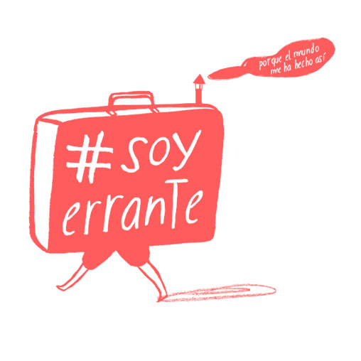
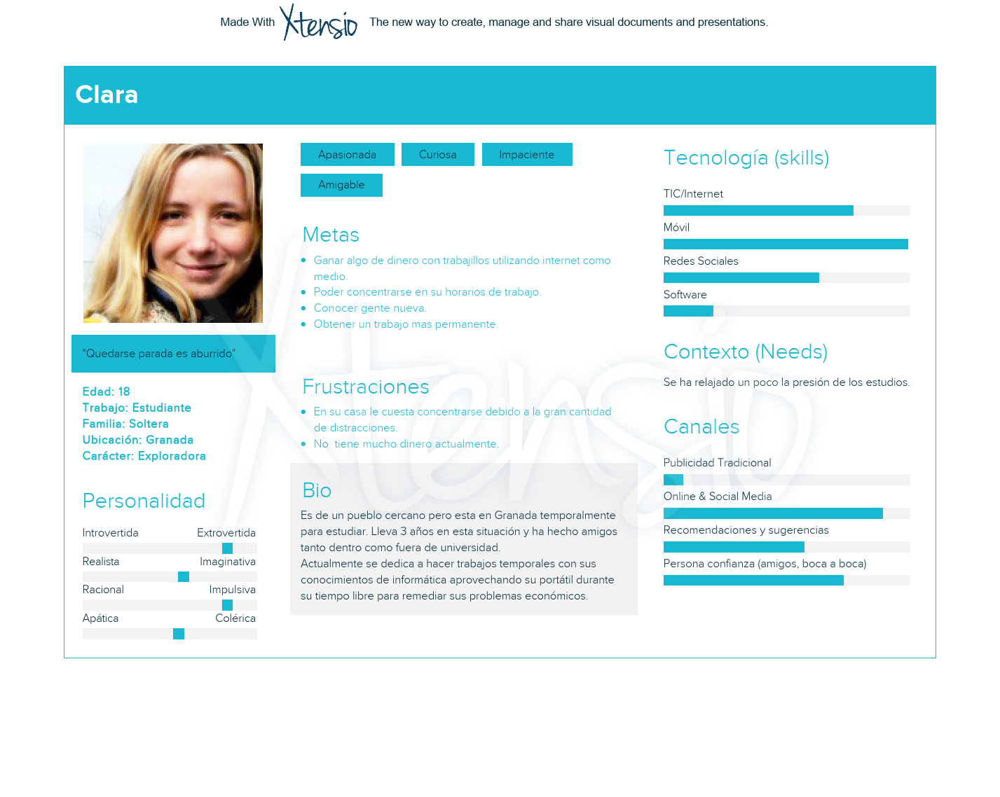
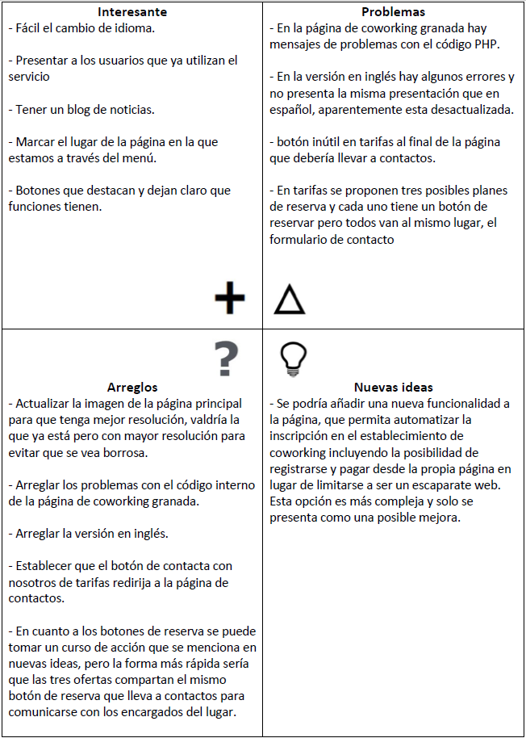
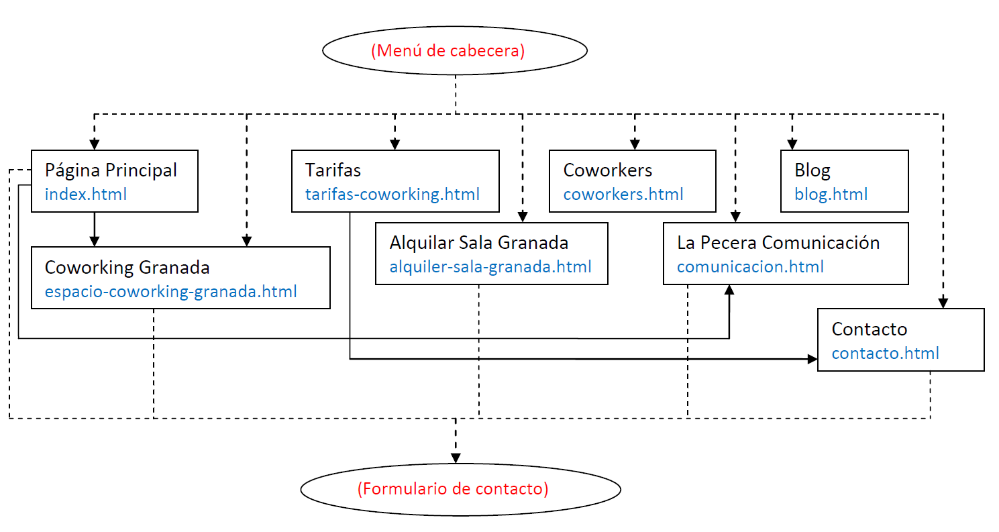
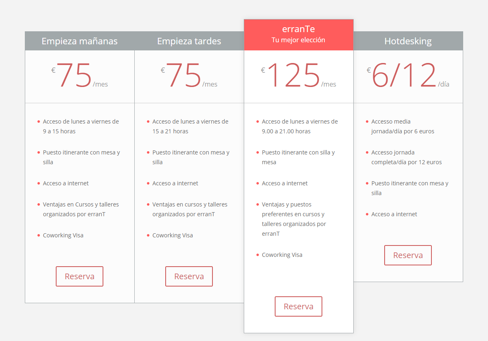
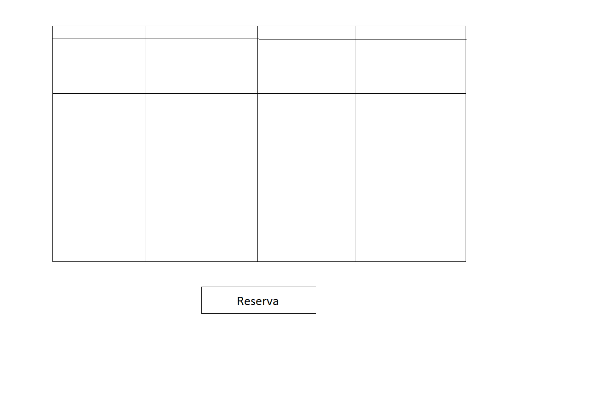
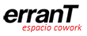

# Examen DIU 
Trabajo Examen de Diseño Interfaces de Usuario 2019-20 (Coworking)

Autor: Jose Melguizo Ruano.  Curso: 2019/20 

Proyecto: erranT

Descripción: Rediseño de la web de erranT.

Logotipo:

----- 

# Proceso de Diseño 

## Paso 1. UX Desk Research & Analisis

1.a Competitive Analysis
-----

La página de erranT es básicamente una página de información sobre el negocio físico que te proporciona los datos de contacto necesarios para poder comunicarte con las personas a cargo, que son las que te ofrecen los servicios.

La página de Cubikate, que era otra posible opción a mejorar sigue un comino similar a erranT, ambas siguen un patrón similar de funcionalidad pero donde realmente se diferencian es en la organización de la información y en el apartado visual.

De entre estas dos he decidido rediseñar erranT porque además de aportar información sobre el negocio físico de coworking también ofrece información sobre el propio equipo encargado que además ofrece algunos servicios adicionales, también cuenta con un blog y un apartado dedicado a presentar a los que han contratado este servicio para trabajar como si de una red social se tratara.

En resumen he seleccionado erranT porque además de su servicio principal de coworking también ofrecen otros servicios adicionales, principalmente informativos, que se compenetran bien con el servicio principal.

1.b Persona
-----

En este caso he reutilizado una persona que cree un una ocasión anterior, Clara, ya que representa a un sector de la población a la que puede interesarle este servicio, aunque ajustado la situación en la que se encuentra para que pueda aprovecharlo, así se podrá comprobar la efectividad de esta web con uno de sus target.

1.c User Journey Map
-----

Este escenario comprueba el funcionamiento de la página con una persona que se encuentra dentro de su público objetivo, algo necesario pues sería una página inútil si no pudiera satisfacer al público al que se dirige.

1.d Usability Review
-----

- Revisión de usabilidad completa: https://github.com/JoseMR6/ExamenDIU/blob/master/contenidos/usabilidad.xls

- Valoración final: 94 / 100

Una página web excelente que solo necesita arreglar algunos apartados técnicos relacionados con su código interno y mejorar la redirección de algunos botones.

1.e Planteamiento del problema
-----

El único problema destacable es que hay que arreglar algunas partes del código interno de la página y que la estructura de la misma es algo caótica debido a varios botones que deberían replantear su direccionamiento.

## Paso 2. UX Design 

2.a Feedback Capture Grid
-----

En esta sección utilizo una malla modificada para resumir los puntos fuertes y débiles de la página, y mis propuestas de mejora.

2.b Propuesta de valor
-----

En base a lo observado esta página ha sido construida en base a "Encuentra un lugar donde ser productivo y amplia tus contactos", debido a que le da mucha importancia las otras personas con las que podrás relacionarte.

Dado que este punto ya está desarrollado, no voy a ampliarlo más, mis propuestas se basan en arreglar errores y actualizar un poco la presentación y estructura.

2.c Sitemap
-----

A continuación se encuentra el Sitemap de erranT, no ha sido modificado pero es bueno tenerlo presente y por eso lo incluyo.

Los cuadros son las secciones de este sitio web, y los óvalos son trozos de una página que están presentes en varios lugares distintos, por ejemplo el menú está presente en todas las páginas de este sitio web y mediante flechas de puntos se indican que páginas del sitio están incorporadas en el menú, todas las páginas incluidas en el menú serán accedidas desde cualquier otra página. En cuanto al formulario de contacto se indica mediante flechas de puntos que páginas lo incluyen, generalmente al final de la página. Las flechas completas son enlaces normales de una página a otra.

Entre las páginas mostradas en el mapa anterior las que puede que sean más difíciles de comprender su función solo por el nombre serían:

Coworkers: Presenta visualmente a los usuarios del servicio de coworking con los que podrás relacionarte si te unes.

La Pecera Comunicación: Se presenta al equipo que administra este servicio.

2.d Bocetos
-----

Una de las propuestas mencionadas anteriormente consistía en que las tarifas tuvieran un solo botón de reserva para evitar confusión, a continuación se muestra el estado actual de la página en este punto y un boceto simplificado de cómo podría adaptarse:

Original

Estructura Propuesta

También he pensado en incluir algunas pequeñas modificaciones visuales como aprovechar el color rojo que se usa en toda la página web como un color representativo también en el título como se muestra a continuación:

Original

Propuesta

Además de lo indicado hasta ahora también convendría tener una versión reducida del logotipo pues el actual es ilegible cuando se utiliza en pequeño como se puede apreciar en el icono de la ventana de la página en el navegador y pierde todo su sentido, debido a esto también propongo una versión del logotipo fácilmente identificable en tamaños pequeños:

Original

Propuesta para tamaños pequeños

